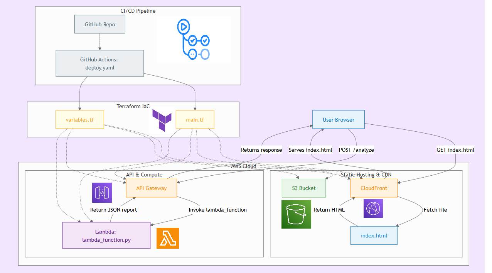

# Essay Inspector

A comprehensive tool for analyzing and evaluating essays using automated scoring and feedback mechanisms.

## 🎯 Overview

Essay Inspector is an intelligent essay analysis system that provides automated scoring, feedback, and detailed insights into essay quality. The tool leverages natural language processing and machine learning techniques to evaluate essays across multiple criteria including grammar, coherence, structure, and content quality.

## ✨ Features

- **Automated Essay Scoring**: AI-powered scoring system that evaluates essays on multiple dimensions
- **Grammar and Style Analysis**: Identifies grammatical errors, style issues, and readability metrics
- **Structure Evaluation**: Analyzes essay organization, paragraph structure, and logical flow
- **Vocabulary Assessment**: Evaluates vocabulary richness, word choice, and complexity
- **Detailed Feedback Reports**: Generates comprehensive reports with actionable suggestions
- **Batch Processing**: Analyze multiple essays simultaneously

Made with ❤️ by [omerteomim](https://github.com/omerteomim)